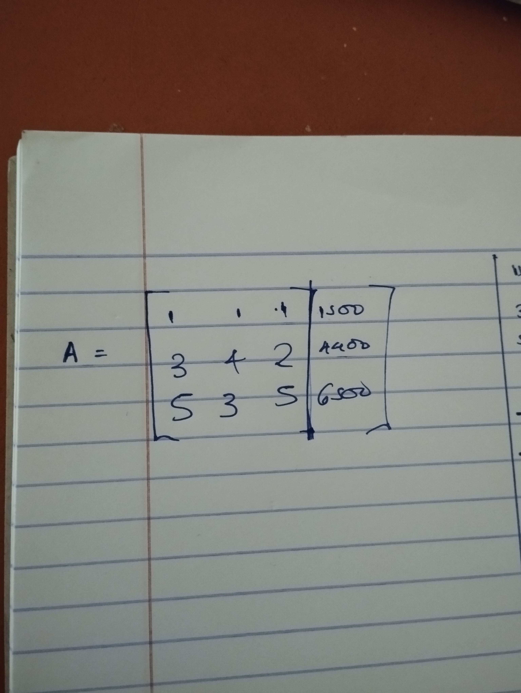

# MATRIX

matrix is a rectangular array of numbers for which operations such as addition and multiplication can be defined.

this horizontal and vertical lines of entries in a matrix are called rows and columns. we normally refer to matrices as `m * n matrix`

Each entry is indexed with row and column numbers i.e X(mn) where m rep row and n rep column.

A matrix with the same number of rows and columns; m = n is called a square matrix, represented as Am. A matrix whose entries are only real numbers is called real matrix.

## AUGUMENTED MATRIX

While representing equation in a matrix form, each equation takes one row of the matrix.

Coefficient of variables from the equation is represented left side of the row, followed by the vertical line and then the RHS of equation, which is a real number, is specified after the vertical line

this form of representing linear equations is known as `augemnted matrix`

in our prevous [linear equation](./linearEquations.md), we had the following equations:

1. 1b + 1ps + 1mt = 1500
2. 3b + 4ps + 2mt = 4400
3. 5b + 3ps + 5mt = 6500

to change this equation in matrix form:

so in the linear equation, we were able to do two operations:

1. addition
2. multiplication

for the matrices, you apply three operations to matrix and it won't affect the end results of a matrix, they include:

1. Swap two rows
2. Multiply a row by a non-zero real number
3. Add to one row a scalar multiple of another

what we are normally trying to achieve here is to get the matrix in acheleon form.

to get the matrix in acheleon form you:

1. all rows that consist of only zero values are at the bottom of the matrix
2. The leading coefficient (leftmost non-zero entry) of a non-zero row is always to the right of the leading coefficient of the row above it

a `reduced` acheleon form is:

1. Matrix row in acheleon form( refer above )
2. Leading entry in all non-zero rows is 1
3. Each column containing leading 1 has zeros in all other entries

